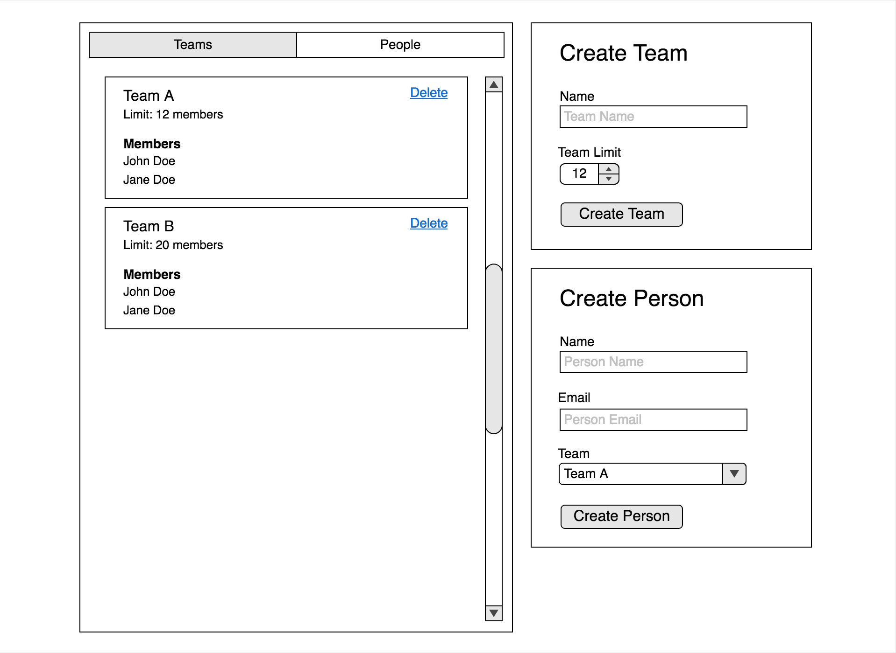
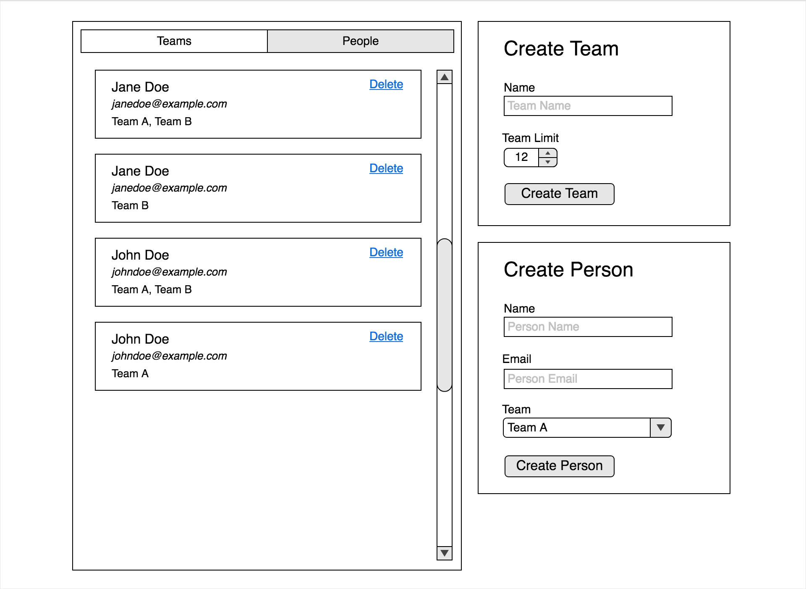

# Northpass Code Challenge

## Getting Started
- Install `yarn` ([install guide](https://yarnpkg.com/lang/en/docs/install/#mac-stable))
- `yarn install` to get dependencies
- `yarn start` to start developing
- `yarn test` to run tests

## What We're Looking For
- You demonstrate that you can create clean, reusable React components
- You use best practices in React and Redux
- You write well-defined tests and assertions
- You leverage good CSS to create UIs that correctly follow a design mockup
- You show an eye for establishing front-end patterns and overall architecture
  through well-written and well-organized code that shows the potential to scale

## Challenge
- Create the UIs you see in the image below
  - _Teams_ shows a list of all created teams. If no teams exist, display a
    zero-state message
  - _Create Team_ adds a new team to the list
  - _People_ shows a list of all created people. If no people exist, display a
    zero-state message
  - _Create Person_ adds a new person to the person list and assigns them to
    one or more teams. If no teams exist, the form is disabled. If a team has
    reached it's teammember limit, it cannot accept new teammembers
  - Teams can be deleted
  - People can be deleted
- Creation forms should be validated on submit
  - All fields are required
  - _Team Limit_ must be an integer between 1 and 20
  - _Name_ must be a non-empty string
  - _Email_ must be a non-empty string with some email pattern checking that
    you determine
- When you're done, add some notes to `NOTES.md` that you feel would be
  beneficial for us to know

## Extras
- Add your own styling to make the UI look pretty
- Add a Rails API layer

## Mockups

## More Info

This project was bootstrapped with
[Create React App](https://github.com/facebookincubator/create-react-app). View
its docs for more info.
